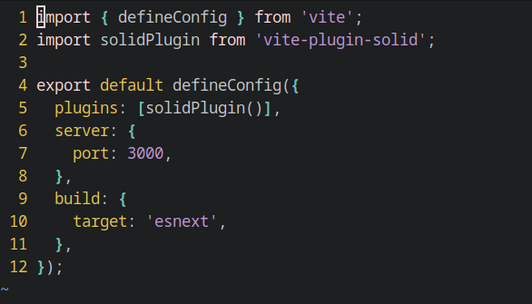

Alacritty Github Theme
=====

This is the Github color scheme for the [Alacritty](https://github.com/alacritty/alacritty) terminal emulator



## Installation

Installing in `~/.config/alacritty`

```bash
cd ~
git clone https://github.com/axemanofic/alacritty-github-theme .alacritty-github-theme
mkdir -p "$HOME/.config/alacritty"
ln -s "$HOME/.alacritty-github-theme/alacritty.yml" "$HOME/.config/alacritty/alacritty.yml"
```

## Features

- Color-schema [Github Dark](https://primer.style/primitives/colors)

## From the author

Thank you for using this color scheme.
If you like it please like it :heart:
